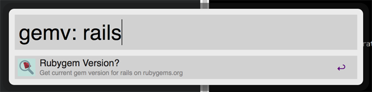

gemv.alfredworkflow
===================

An Alfred 2 workflow for searching rubygems.org for a gem's current version number and copying it to your clipboard.

This workflow will output the version number in Alfred's "Large Type"
and copy the number to your clipboard.
